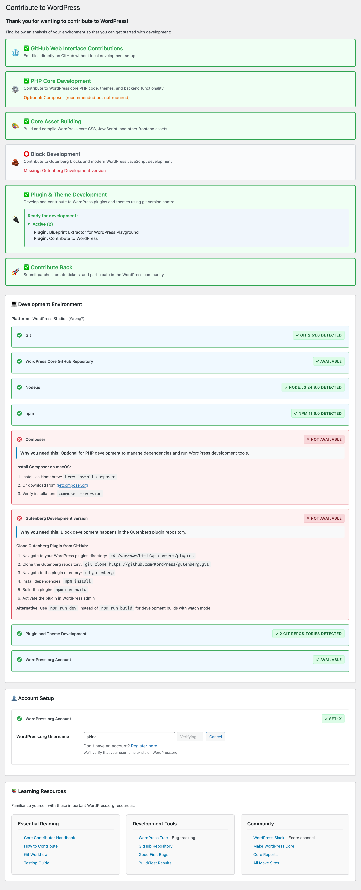

# Contribute to WordPress

A WordPress plugin that helps developers get ready for contributing to WordPress core, themes, and plugins.

[Try it in Playground!](https://playground.wordpress.net/#{"landingPage":"/wp-admin/admin.php?page=contribute-to-wordpress","steps":[{"step":"installPlugin","pluginData":{"resource":"url","url":"https://github-proxy.com/proxy/?repo=akirk/contribute-to-wordpress&branch=main"},"options":{"activate":false}},{"step":"activatePlugin","pluginPath":"/wordpress/wp-content/plugins/contribute-to-wordpress-main/contribute-to-wordpress.php"},{"step":"login","username":"admin","password":"password"}]}) While not very representative regarding the environment checks, you can toggle the tool checks by clicking on the "Not Available" badges.

## Screenshots

## Installation

1. Clone or download this repository to your `wp-content/plugins/` directory
2. Activate the plugin in WordPress admin
3. Go to **Tools → Contribute to WordPress** to get started

## Usage

The plugin gives you an overview of your readiness to contribute to WordPress. It will tell you if your environment is ready for:

- Contributing through the GitHub Web Interface
- WordPress Core PHP Development
- WordPress Core Asset Building
- Block Development
- Plugin & Theme Development

And then helps you figure out what you need to do to get ready:

